# Transcription Flow — Full Diagram

Complete Mermaid flowchart covering the entire voice/audio transcription pipeline: from message receipt through validation, download, preprocessing, transcription, LLM post-processing, result delivery, and interactive buttons.

All environment variables that influence branching are shown inline.
Database operations (💾) are annotated where they occur.

```mermaid
flowchart TD
    %% ── ENTRY ──────────────────────────────────────────────
    MSG["📩 User sends message<br/>(voice / audio / document / video)"]

    MSG --> IS_DOC{"Message type?"}

    IS_DOC -->|voice| UNIFIED["_handle_media_message()"]
    IS_DOC -->|audio| UNIFIED
    IS_DOC -->|"document<br/>(ENABLE_DOCUMENT_HANDLER)"| MIME{"MIME ∈<br/>SUPPORTED_AUDIO_MIMES ∪<br/>SUPPORTED_VIDEO_MIMES?"}
    IS_DOC -->|"video<br/>(ENABLE_VIDEO_HANDLER)"| UNIFIED

    MIME -->|No| IGNORE["🔇 Ignore silently"]
    MIME -->|Yes| UNIFIED

    %% ── VALIDATION ─────────────────────────────────────────
    UNIFIED --> DUR_CHK{"Duration ≤<br/>MAX_VOICE_DURATION_SECONDS<br/>(10 800 s)?"}
    DUR_CHK -->|No| ERR_DUR["⚠️ Максимальная<br/>длительность: N мин"]
    DUR_CHK -->|Yes| QUEUE_CHK{"Queue depth <<br/>MAX_QUEUE_SIZE (10)?"}
    QUEUE_CHK -->|No| ERR_QUEUE["⚠️ Очередь переполнена"]
    QUEUE_CHK -->|Yes| SIZE_CHK{"file_size ≤<br/>MAX_FILE_SIZE_BYTES<br/>(20 MB)?"}

    SIZE_CHK -->|Yes| QUOTA_CHK
    SIZE_CHK -->|"No & TELETHON_ENABLED"| QUOTA_CHK
    SIZE_CHK -->|"No & !TELETHON_ENABLED"| ERR_SIZE["⚠️ Файл слишком большой"]

    QUOTA_CHK{"ENABLE_QUOTA_CHECK?"}
    QUOTA_CHK -->|"No (default)"| DB_USER
    QUOTA_CHK -->|Yes| QUOTA_OK{"Remaining quota ≥<br/>requested duration?<br/>(DEFAULT_DAILY_QUOTA_SECONDS)"}
    QUOTA_OK -->|No| ERR_QUOTA["⚠️ Достигнут дневной лимит"]
    QUOTA_OK -->|Yes| DB_USER

    %% ── DB: CREATE USER & USAGE ───────────────────────────
    DB_USER["💾 DB: Create User if new<br/>(UserRepository.create)"]
    DB_USER --> DB_USAGE["💾 DB: Create Usage record<br/>(UsageRepository.create)"]
    DB_USAGE --> STATUS_DL

    %% ── DOWNLOAD ───────────────────────────────────────────
    STATUS_DL["📥 Загружаю файл..."]
    STATUS_DL --> DL_DECIDE{"file_size > 20 MB?"}
    DL_DECIDE -->|Yes| TELETHON["Telethon Client API<br/>(MTProto, up to 2 GB)"]
    DL_DECIDE -->|No| BOTAPI["Telegram Bot API<br/>(standard HTTP)"]

    TELETHON --> IS_VIDEO
    BOTAPI --> IS_VIDEO

    IS_VIDEO{"Is video?"}
    IS_VIDEO -->|No| IS_DOC_FILE{"Is document?"}
    IS_VIDEO -->|Yes| STATUS_VIDEO["🎵 Извлекаю аудиодорожку..."]
    STATUS_VIDEO --> FFMPEG_EXTRACT["ffmpeg extract audio<br/>(mono Opus 16 kHz)"]
    FFMPEG_EXTRACT --> HAS_AUDIO{"Has audio stream?<br/>(ffprobe)"}
    HAS_AUDIO -->|No| ERR_NOAUDIO["❌ Видео не содержит<br/>аудиодорожки"]
    HAS_AUDIO -->|Yes| DOC_QUOTA_CHK

    IS_DOC_FILE -->|"Yes (document)"| FFPROBE["ffprobe → get duration"]
    IS_DOC_FILE -->|No| ENQUEUE
    FFPROBE --> DOC_QUOTA_CHK{"ENABLE_QUOTA_CHECK<br/>& duration known?"}
    DOC_QUOTA_CHK -->|"No (default)"| ENQUEUE
    DOC_QUOTA_CHK -->|Yes| DOC_QUOTA_OK{"Quota OK?"}
    DOC_QUOTA_OK -->|No| ERR_QUOTA
    DOC_QUOTA_OK -->|Yes| ENQUEUE

    %% ── ENQUEUE ────────────────────────────────────────────
    ENQUEUE["queue_manager.enqueue(request)"]
    ENQUEUE --> QUEUE_POS{"Position > 1 or<br/>workers busy?"}
    QUEUE_POS -->|Yes| STATUS_QUEUE["📋 В очереди: позиция N<br/>⏱️ Ожидание: ~Xм<br/>🎯 Обработка: ~Yм<br/><i>updates on position shift</i>"]
    QUEUE_POS -->|No| STATUS_START["⚙️ Начинаю обработку..."]

    STATUS_QUEUE --> WORKER
    STATUS_START --> WORKER

    %% ── WORKER (background) ────────────────────────────────
    WORKER["Worker picks request<br/>(semaphore: MAX_CONCURRENT_WORKERS)<br/>timeout: TRANSCRIPTION_TIMEOUT"]

    WORKER --> PREPROCESS

    %% ── PREPROCESSING ──────────────────────────────────────
    PREPROCESS{"Need preprocessing?<br/>AUDIO_CONVERT_TO_MONO ||<br/>AUDIO_SPEED_MULTIPLIER ≠ 1.0 ||<br/>Format conversion needed"}
    PREPROCESS -->|No| RETRANSCRIBE_SAVE
    PREPROCESS -->|Yes| STATUS_OPT["🔧 Оптимизирую аудио..."]
    STATUS_OPT --> PP_STEPS["AudioHandler.preprocess_audio()<br/>• Format: OGA→MP3/WAV for gpt-4o<br/>  (OPENAI_4O_TRANSCRIBE_PREFERRED_FORMAT)<br/>• Mono (AUDIO_TARGET_SAMPLE_RATE = 16 kHz)<br/>• Speed (AUDIO_SPEED_MULTIPLIER)"]
    PP_STEPS --> RETRANSCRIBE_SAVE

    RETRANSCRIBE_SAVE{"ENABLE_RETRANSCRIBE?"}
    RETRANSCRIBE_SAVE -->|No| PROGRESS_START
    RETRANSCRIBE_SAVE -->|Yes| SAVE_AUDIO["Save audio copy<br/>(PERSISTENT_AUDIO_DIR)<br/>💾 DB: Update Usage<br/>(original_file_path)"]
    SAVE_AUDIO --> PROGRESS_START

    %% ── PROGRESS TRACKER ───────────────────────────────────
    PROGRESS_START["Start ProgressTracker<br/>⚙️ Обрабатываю запись...<br/>🔄 ████░░░░ 40%<br/>(updates every PROGRESS_UPDATE_INTERVAL s,<br/>rate limit: PROGRESS_GLOBAL_RATE_LIMIT,<br/>RTF = PROGRESS_RTF)"]

    PROGRESS_START --> ROUTING

    %% ── ROUTING STRATEGY ───────────────────────────────────
    ROUTING{"WHISPER_ROUTING_STRATEGY?"}

    ROUTING -->|"single"| R_SINGLE["SingleProviderStrategy<br/>→ PRIMARY_PROVIDER"]
    ROUTING -->|"fallback"| R_FALLBACK["FallbackStrategy<br/>→ PRIMARY_PROVIDER<br/>→ on error: FALLBACK_PROVIDER<br/>(DURATION_THRESHOLD_SECONDS)"]
    ROUTING -->|"hybrid"| R_HYBRID["HybridStrategy<br/>duration < HYBRID_SHORT_THRESHOLD?<br/>→ HYBRID_DRAFT_PROVIDER<br/>  (HYBRID_DRAFT_MODEL)<br/>→ HYBRID_QUALITY_PROVIDER<br/>  (HYBRID_QUALITY_MODEL)"]
    ROUTING -->|"structure<br/>(default)"| R_STRUCT["StructureStrategy<br/>→ STRUCTURE_PROVIDER<br/>→ STRUCTURE_MODEL"]
    ROUTING -->|"benchmark<br/>(BENCHMARK_MODE)"| R_BENCH_INNER["BenchmarkStrategy<br/>→ all BENCHMARK_CONFIGS"]

    R_SINGLE --> PROVIDER_CALL
    R_FALLBACK --> PROVIDER_CALL
    R_HYBRID --> PROVIDER_CALL
    R_STRUCT --> PROVIDER_CALL
    R_BENCH_INNER --> PROVIDER_CALL

    %% ── OPENAI LONG AUDIO ──────────────────────────────────
    PROVIDER_CALL{"OpenAI & duration ><br/>OPENAI_GPT4O_MAX_DURATION<br/>(420 s)?"}

    PROVIDER_CALL -->|No| TRANSCRIBE["Transcribe normally<br/>(single API call)"]
    PROVIDER_CALL -->|Yes| LONG_DECIDE{"Long audio strategy?"}

    LONG_DECIDE -->|"OPENAI_CHANGE_MODEL<br/>= true"| MODEL_SWITCH["Switch to whisper-1<br/>(unlimited duration)"]
    LONG_DECIDE -->|"OPENAI_CHUNKING<br/>= true (default)"| CHUNK_MODE{"OPENAI_PARALLEL_CHUNKS?"}

    CHUNK_MODE -->|"true (default)"| PAR_CHUNK["Split → parallel chunks<br/>max OPENAI_MAX_PARALLEL_CHUNKS (8)<br/>chunk = OPENAI_CHUNK_SIZE_SECONDS<br/>overlap = OPENAI_CHUNK_OVERLAP_SECONDS<br/>(oversized chunks → warning, not blocked)"]
    CHUNK_MODE -->|false| SEQ_CHUNK["Split → sequential chunks<br/>(context-aware)"]

    MODEL_SWITCH --> TRANSCRIBE_RESULT
    PAR_CHUNK --> TRANSCRIBE_RESULT
    SEQ_CHUNK --> TRANSCRIBE_RESULT
    TRANSCRIBE --> TRANSCRIBE_RESULT

    %% ── STOP PROGRESS & POST-PROCESS ──────────────────────
    TRANSCRIBE_RESULT["Raw transcription text"]
    TRANSCRIBE_RESULT --> STOP_PROGRESS["Stop ProgressTracker"]
    STOP_PROGRESS --> POST_LLM

    %% ── POST-TRANSCRIPTION LLM ─────────────────────────────
    POST_LLM{"Strategy requires<br/>LLM post-processing?<br/>(LLM_REFINEMENT_ENABLED<br/>& !context.disable_refinement)"}

    POST_LLM -->|"StructureStrategy<br/>& duration ≥<br/>STRUCTURE_DRAFT_THRESHOLD"| STRUCT_FLOW
    POST_LLM -->|"HybridStrategy<br/>& duration ≥<br/>HYBRID_SHORT_THRESHOLD"| HYBRID_FLOW
    POST_LLM -->|No| FINALIZE

    subgraph STRUCT_FLOW["Structure flow"]
        direction TB
        S1["💾 DB: Save original variant<br/>(variant_repo.create mode=original)"]
        S1 --> S2{"duration ≥<br/>STRUCTURE_DRAFT_THRESHOLD?"}
        S2 -->|Yes| S2a["Send draft message"]
        S2 -->|No| S3
        S2a --> S3["Status: 🔄 Улучшаю текст..."]
        S3 --> S4["TextProcessor.create_structured()<br/>LLM_PROVIDER / LLM_MODEL<br/>emoji_level = STRUCTURE_EMOJI_LEVEL (0-3)<br/>LLM_TIMEOUT, LLM_MAX_TOKENS"]
        S4 --> S5["💾 DB: Save structured variant<br/>(variant_repo.create mode=structured)"]
        S5 --> S5a["💾 DB: Update Usage<br/>(llm_processing_time)"]
        S5a --> S6["Delete draft/status messages"]
    end

    subgraph HYBRID_FLOW["Hybrid refinement flow"]
        direction TB
        H1["Send draft text"]
        H1 --> H2["Status: 🔄 Улучшаю текст..."]
        H2 --> H3["LLMService.refine_transcription()<br/>LLM_PROVIDER / LLM_MODEL<br/>LLM_TIMEOUT, LLM_MAX_TOKENS"]
        H3 --> H3a["💾 DB: Update Usage<br/>(llm_processing_time)"]
        H3a --> H4["Delete draft messages"]
        H4 --> H5{"LLM_DEBUG_MODE?"}
        H5 -->|Yes| H6["Send debug comparison<br/>(draft vs refined)"]
        H5 -->|No| H_END[" "]
    end

    STRUCT_FLOW --> LLM_LONG_CHK
    HYBRID_FLOW --> LLM_LONG_CHK

    %% ── LLM LONG TEXT HANDLING ──────────────────────────────
    LLM_LONG_CHK{"Text tokens ><br/>LLM_CHUNKING_THRESHOLD<br/>(1 300)?"}
    LLM_LONG_CHK -->|No| FINALIZE
    LLM_LONG_CHK -->|Yes| LLM_LONG{"LLM_LONG_TEXT_STRATEGY?"}
    LLM_LONG -->|"chunking (default)"| LLM_CHUNK["Split text → chunks<br/>(LLM_CHUNK_MAX_CHARS = 4096)<br/>Process in parallel/seq<br/>(LLM_PARALLEL_CHUNKS,<br/>LLM_MAX_PARALLEL_CHUNKS = 8)"]
    LLM_LONG -->|"reasoner"| LLM_REASON["Use reasoner model<br/>(LLM_MAX_TOKENS_REASONER = 64 000)"]
    LLM_CHUNK --> FINALIZE
    LLM_REASON --> FINALIZE

    %% ── FINALIZE & SEND ────────────────────────────────────
    FINALIZE["Final text ready"]
    FINALIZE --> DB_STATE

    %% ── DB: CREATE STATE & VARIANTS ────────────────────────
    DB_STATE["💾 DB: Create TranscriptionState<br/>(cleanup stale placeholder first)<br/>💾 DB: Create original variant<br/>(if not exists)"]
    DB_STATE --> SEGMENTS_CHK{"ENABLE_TIMESTAMPS_OPTION<br/>& segments exist<br/>& duration ≥ TIMESTAMPS_MIN_DURATION?"}
    SEGMENTS_CHK -->|Yes| DB_SEGMENTS["💾 DB: Create segments batch<br/>(segment_repo.create_batch)"]
    SEGMENTS_CHK -->|No| DELETE_STATUS
    DB_SEGMENTS --> DELETE_STATUS

    DELETE_STATUS["Delete status message"]
    DELETE_STATUS --> MSG_LEN{"len(text) ≤<br/>FILE_THRESHOLD_CHARS<br/>(3 900)?"}

    MSG_LEN -->|Yes| SEND_TEXT["Send text message<br/>+ inline keyboard"]
    MSG_LEN -->|No| SEND_FILE["Send info: 📝 Транскрипция готова!<br/>Send file (PDF / TXT)<br/>+ inline keyboard"]

    SEND_TEXT --> DB_STATE_UPDATE
    SEND_FILE --> DB_STATE_UPDATE

    DB_STATE_UPDATE["💾 DB: Update TranscriptionState<br/>(message_id, is_file_message,<br/>file_message_id)"]
    DB_STATE_UPDATE --> DB_USAGE_FINAL["💾 DB: Final Usage update<br/>(model_size, processing_time,<br/>transcription_length, llm_model)"]
    DB_USAGE_FINAL --> SEND_RESULT

    %% ── INTERACTIVE KEYBOARD ────────────────────────────────
    SEND_RESULT["✅ Result delivered"]

    SEND_RESULT --> KB_CHK{"INTERACTIVE_MODE_ENABLED?"}
    KB_CHK -->|No| DONE["Done"]
    KB_CHK -->|"Yes (default)"| KEYBOARD

    subgraph KEYBOARD["Inline Keyboard (callback buttons)"]
        direction TB
        KB1["📄 Исходный текст — always present"]
        KB2["📝 Структурировать — ENABLE_STRUCTURED_MODE"]
        KB3["📋 О чем этот текст — ENABLE_SUMMARY_MODE"]
        KB4["🪄 Сделать красиво — ENABLE_MAGIC_MODE"]
        KB5["🔽 Короче / 🔼 Длиннее — ENABLE_LENGTH_VARIATIONS<br/>(5 levels)"]
        KB6["😀 Эмодзи ±1 — ENABLE_EMOJI_OPTION<br/>(levels 0-3)"]
        KB7["⏱️ Временные метки — ENABLE_TIMESTAMPS_OPTION"]
        KB8["📥 Скачать — ENABLE_DOWNLOAD_BUTTON<br/>(txt / md / pdf / docx)"]
        KB9["🔄 Переснять — ENABLE_RETRANSCRIBE"]

        KB1 --- KB2 --- KB3 --- KB4
        KB4 --- KB5 --- KB6 --- KB7
        KB7 --- KB8 --- KB9
    end

    KEYBOARD --> BUTTON_PRESS["User presses button"]
    BUTTON_PRESS --> VARIANT_CHK{"Variant cached?<br/>(VARIANT_CACHE_TTL_DAYS = 7,<br/>MAX_CACHED_VARIANTS_PER_TRANSCRIPTION = 10)"}
    VARIANT_CHK -->|Yes| SHOW_CACHED["Show cached variant"]
    VARIANT_CHK -->|No| GEN_VARIANT["Generate via LLM<br/>(TextProcessor)<br/>💾 DB: Create variant<br/>(get_or_create_variant)"]
    GEN_VARIANT --> UPDATE_DISPLAY["Update display<br/>💾 DB: Update TranscriptionState<br/>(file_message_id on text↔file switch)"]
    SHOW_CACHED --> UPDATE_DISPLAY
    UPDATE_DISPLAY --> BUTTON_PRESS

    %% ── ERROR HANDLING ──────────────────────────────────────
    WORKER -. "error at any stage" .-> ERR_HANDLER
    ERR_HANDLER["❌ Произошла ошибка<br/>при обработке...<br/>(BotError.user_message)"]
    ERR_HANDLER --> ERR_GRACEFUL{"LLM-only failure?"}
    ERR_GRACEFUL -->|Yes| FALLBACK_ORIG["Return original text<br/>+ ℹ️ недоступно"]
    ERR_GRACEFUL -->|No| ERR_FINAL["Show error to user,<br/>cleanup temp files"]

    FALLBACK_ORIG --> FINALIZE

    %% ── STYLING ─────────────────────────────────────────────
    classDef status fill:#e1f5fe,stroke:#0288d1
    classDef error fill:#ffebee,stroke:#c62828
    classDef decision fill:#fff9c4,stroke:#f9a825
    classDef action fill:#e8f5e9,stroke:#2e7d32
    classDef result fill:#f3e5f5,stroke:#7b1fa2
    classDef db fill:#fff3e0,stroke:#e65100

    class STATUS_DL,STATUS_VIDEO,STATUS_OPT,STATUS_START,STATUS_QUEUE,PROGRESS_START status
    class ERR_DUR,ERR_QUEUE,ERR_SIZE,ERR_QUOTA,ERR_NOAUDIO,ERR_HANDLER,ERR_FINAL error
    class IS_DOC,DUR_CHK,QUEUE_CHK,SIZE_CHK,QUOTA_CHK,QUOTA_OK,IS_VIDEO,IS_DOC_FILE,DOC_QUOTA_CHK,DOC_QUOTA_OK,QUEUE_POS,PREPROCESS,ROUTING,PROVIDER_CALL,LONG_DECIDE,CHUNK_MODE,POST_LLM,LLM_LONG_CHK,LLM_LONG,MSG_LEN,KB_CHK,VARIANT_CHK,ERR_GRACEFUL,RETRANSCRIBE_SAVE,SEGMENTS_CHK,S2 decision
    class FFMPEG_EXTRACT,PP_STEPS,TRANSCRIBE,MODEL_SWITCH,PAR_CHUNK,SEQ_CHUNK action
    class SEND_RESULT,DONE,SHOW_CACHED result
    class DB_USER,DB_USAGE,DB_STATE,DB_SEGMENTS,DB_STATE_UPDATE,DB_USAGE_FINAL,SAVE_AUDIO,S1,S5,S5a,H3a,GEN_VARIANT,UPDATE_DISPLAY db
```

