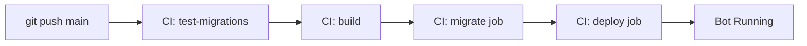

# Migration Runbook

Operational procedures for database migrations in production.

## Table of Contents

- [Overview](#overview)
- [Pre-Deployment Checklist](#pre-deployment-checklist)
- [Automated Deployment](#automated-deployment)
- [Manual Migration Procedures](#manual-migration-procedures)
- [Rollback Procedures](#rollback-procedures)
- [Emergency Procedures](#emergency-procedures)
- [Monitoring and Verification](#monitoring-and-verification)

## Overview

This runbook provides step-by-step procedures for managing database migrations in production. Migrations are typically automated through CI/CD, but manual procedures are documented for emergency situations.

**Production Environment**:
- **VPS**: Russian VPS (2GB RAM)
- **Database**: SQLite at `/opt/telegram-voice2text-bot/data/bot.db`
- **Container**: `telegram-voice2text-bot`
- **Deployment**: GitHub Actions (automated)

## Pre-Deployment Checklist

Before deploying changes that include migrations:

### 1. Review Migration Code

- [ ] Migration tested locally (fresh DB and upgrade/downgrade cycle)
- [ ] Both `upgrade()` and `downgrade()` functions implemented
- [ ] Migration passes CI tests
- [ ] Code review completed
- [ ] Breaking changes documented

### 2. Communication

- [ ] Team notified of deployment
- [ ] Expected downtime communicated (if any)
- [ ] Rollback plan documented

### 3. Backup Strategy

- [ ] Database backup available (see [Backup Procedures](#backup-procedures))
- [ ] Previous container image tagged and available
- [ ] Rollback steps documented

### 4. Deployment Window

- [ ] Low-traffic period selected
- [ ] Monitoring in place
- [ ] On-call engineer available

## Automated Deployment

### Normal Deployment Flow

Migrations are applied automatically when pushing to `main` branch:



**Steps**:

1. **Push to main**:
   ```bash
   git push origin main
   ```

2. **Monitor GitHub Actions**:
   - Open: https://github.com/konstantinbalakin/telegram-voice2text-bot/actions
   - Watch workflow progress
   - Check logs if any step fails

3. **Verify Deployment**:
   ```bash
   # Check migration status
   ssh user@vps "cd /opt/telegram-voice2text-bot && docker compose logs bot | grep -i migration"

   # Check container health
   ssh user@vps "docker ps | grep telegram-voice2text-bot"
   ```

### What Happens During Automated Migration

**migrate job** (runs before deploy):

1. SSH to VPS
2. Pull latest code (including migration files)
3. Show current database revision
4. Run `alembic upgrade head` in container
5. If successful: Show new revision, proceed to deploy
6. If failed: Run `alembic downgrade -1`, stop deployment

**deploy job** (runs after migration):

1. Pull new Docker image
2. Restart bot container
3. Wait for health check
4. Verify deployment

### Deployment Timeline

| Phase | Duration | Description |
|-------|----------|-------------|
| Build | 3-5 min | Build and push Docker image |
| Migrate | 5-30 sec | Apply database migrations |
| Deploy | 15-30 sec | Restart bot container |
| Total | 4-6 min | Complete deployment |

**Downtime**: ~15-30 seconds during container restart (after migration)

## Manual Migration Procedures

Use manual procedures when:
- CI/CD is unavailable
- Testing migration in production-like environment
- Emergency hotfix required

### Backup Procedures

**Always backup before manual migration:**

```bash
# SSH to VPS
ssh user@your-vps

# Navigate to project
cd /opt/telegram-voice2text-bot

# Backup database with timestamp
TIMESTAMP=$(date +%Y%m%d_%H%M%S)
cp data/bot.db data/bot.db.backup_${TIMESTAMP}

# Verify backup
ls -lh data/bot.db*
```

### Manual Migration Application

```bash
# SSH to VPS
ssh user@your-vps
cd /opt/telegram-voice2text-bot

# 1. Check current revision
docker run --rm \
  -v $(pwd)/data:/app/data \
  -v $(pwd)/alembic:/app/alembic \
  -v $(pwd)/alembic.ini:/app/alembic.ini \
  -e DATABASE_URL=sqlite+aiosqlite:////app/data/bot.db \
  konstantinbalakin/telegram-voice2text-bot:latest \
  alembic current

# 2. Show pending migrations
docker run --rm \
  -v $(pwd)/data:/app/data \
  -v $(pwd)/alembic:/app/alembic \
  -v $(pwd)/alembic.ini:/app/alembic.ini \
  konstantinbalakin/telegram-voice2text-bot:latest \
  alembic history

# 3. Apply migrations
docker run --rm \
  -v $(pwd)/data:/app/data \
  -v $(pwd)/alembic:/app/alembic \
  -v $(pwd)/alembic.ini:/app/alembic.ini \
  -e DATABASE_URL=sqlite+aiosqlite:////app/data/bot.db \
  konstantinbalakin/telegram-voice2text-bot:latest \
  alembic upgrade head

# 4. Verify new revision
docker run --rm \
  -v $(pwd)/data:/app/data \
  -v $(pwd)/alembic:/app/alembic \
  -v $(pwd)/alembic.ini:/app/alembic.ini \
  -e DATABASE_URL=sqlite+aiosqlite:////app/data/bot.db \
  konstantinbalakin/telegram-voice2text-bot:latest \
  alembic current

# 5. Restart bot
docker compose -f docker-compose.prod.yml restart bot

# 6. Check logs
docker compose -f docker-compose.prod.yml logs --tail=50 bot
```

## Rollback Procedures

### Automated Rollback

If migration fails during CI/CD:

1. Workflow automatically runs `alembic downgrade -1`
2. Deployment stops
3. Bot continues running old version
4. Fix migration, push new commit

### Manual Rollback

**Scenario**: Migration succeeded but caused issues.

```bash
# SSH to VPS
ssh user@your-vps
cd /opt/telegram-voice2text-bot

# 1. Stop bot (to prevent data corruption)
docker compose -f docker-compose.prod.yml stop bot

# 2. Rollback migration
docker run --rm \
  -v $(pwd)/data:/app/data \
  -v $(pwd)/alembic:/app/alembic \
  -v $(pwd)/alembic.ini:/app/alembic.ini \
  -e DATABASE_URL=sqlite+aiosqlite:////app/data/bot.db \
  konstantinbalakin/telegram-voice2text-bot:latest \
  alembic downgrade -1

# 3. Verify revision
docker run --rm \
  -v $(pwd)/data:/app/data \
  -v $(pwd)/alembic:/app/alembic \
  -v $(pwd)/alembic.ini:/app/alembic.ini \
  -e DATABASE_URL=sqlite+aiosqlite:////app/data/bot.db \
  konstantinbalakin/telegram-voice2text-bot:latest \
  alembic current

# 4. Rollback to previous container image
docker tag konstantinbalakin/telegram-voice2text-bot:<previous-sha> \
           konstantinbalakin/telegram-voice2text-bot:latest

# 5. Start bot with old version
docker compose -f docker-compose.prod.yml up -d bot

# 6. Verify health
docker compose -f docker-compose.prod.yml ps
docker compose -f docker-compose.prod.yml logs --tail=50 bot
```

### Restore from Backup

**Last resort** if rollback fails:

```bash
# SSH to VPS
ssh user@your-vps
cd /opt/telegram-voice2text-bot

# 1. Stop bot
docker compose -f docker-compose.prod.yml stop bot

# 2. Restore backup
BACKUP_FILE=data/bot.db.backup_20250124_153000  # Replace with actual backup
cp ${BACKUP_FILE} data/bot.db

# 3. Verify database
sqlite3 data/bot.db "SELECT * FROM alembic_version;"

# 4. Start bot
docker compose -f docker-compose.prod.yml up -d bot

# 5. Verify
docker compose -f docker-compose.prod.yml logs --tail=50 bot
```

## Emergency Procedures

### Migration Stuck

**Symptoms**: Migration running for too long (>5 minutes).

```bash
# 1. Check if container is running
docker ps -a | grep telegram

# 2. Check container logs
docker logs <container-id>

# 3. If stuck, kill migration container
docker kill <container-id>

# 4. Check database lock
sqlite3 data/bot.db "PRAGMA busy_timeout;"

# 5. If locked, restart bot
docker compose -f docker-compose.prod.yml restart bot
```

### Database Corruption

**Symptoms**: SQLite errors, integrity check failures.

```bash
# 1. Stop bot
docker compose -f docker-compose.prod.yml stop bot

# 2. Check database integrity
sqlite3 data/bot.db "PRAGMA integrity_check;"

# 3. If corrupted, restore from backup
cp data/bot.db.backup_latest data/bot.db

# 4. Restart bot
docker compose -f docker-compose.prod.yml up -d bot
```

### Schema Mismatch After Deploy

**Symptoms**: Bot crashes with "Database schema mismatch" error.

```bash
# 1. Check bot logs
docker compose -f docker-compose.prod.yml logs bot | grep -i schema

# 2. Check current migration
docker run --rm \
  -v $(pwd)/data:/app/data \
  -v $(pwd)/alembic:/app/alembic \
  -v $(pwd)/alembic.ini:/app/alembic.ini \
  konstantinbalakin/telegram-voice2text-bot:latest \
  alembic current

# 3. Apply missing migrations
docker run --rm \
  -v $(pwd)/data:/app/data \
  -v $(pwd)/alembic:/app/alembic \
  -v $(pwd)/alembic.ini:/app/alembic.ini \
  -e DATABASE_URL=sqlite+aiosqlite:////app/data/bot.db \
  konstantinbalakin/telegram-voice2text-bot:latest \
  alembic upgrade head

# 4. Restart bot
docker compose -f docker-compose.prod.yml restart bot
```

## Monitoring and Verification

### Check Migration Status

```bash
# Current revision
docker run --rm \
  -v $(pwd)/data:/app/data \
  -v $(pwd)/alembic:/app/alembic \
  -v $(pwd)/alembic.ini:/app/alembic.ini \
  konstantinbalakin/telegram-voice2text-bot:latest \
  alembic current

# Migration history
docker run --rm \
  -v $(pwd)/alembic:/app/alembic \
  -v $(pwd)/alembic.ini:/app/alembic.ini \
  konstantinbalakin/telegram-voice2text-bot:latest \
  alembic history
```

### Verify Bot Health

```bash
# Container status
docker ps | grep telegram-voice2text-bot

# Health check status
docker inspect telegram-voice2text-bot | jq '.[0].State.Health'

# Recent logs
docker compose -f docker-compose.prod.yml logs --tail=100 bot

# Check for errors
docker compose -f docker-compose.prod.yml logs bot | grep -i error
```

### Database Queries

```bash
# Connect to database
sqlite3 data/bot.db

# Check tables
.tables

# Check migration version
SELECT * FROM alembic_version;

# Check row counts
SELECT
  (SELECT COUNT(*) FROM users) as users,
  (SELECT COUNT(*) FROM transactions) as transactions,
  (SELECT COUNT(*) FROM usage) as usage;

# Exit
.quit
```

### Performance Monitoring

```bash
# Container resource usage
docker stats telegram-voice2text-bot --no-stream

# Database file size
du -h data/bot.db

# Log file size
du -h logs/
```

## Related Documentation

- [Database Migrations](../development/database-migrations.md) - Development migration guide
- [VPS Setup](./vps-setup.md) - VPS deployment setup
- [CI/CD Pipeline](./cicd-pipeline.md) - GitHub Actions workflow
- [Troubleshooting](../TROUBLESHOOTING.md) - General troubleshooting guide
