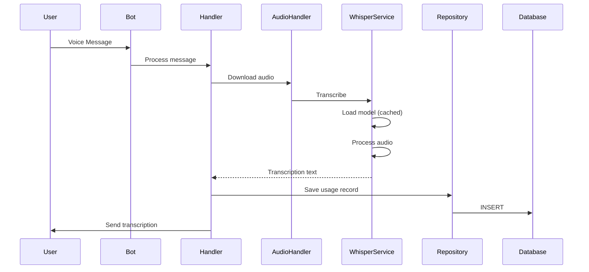
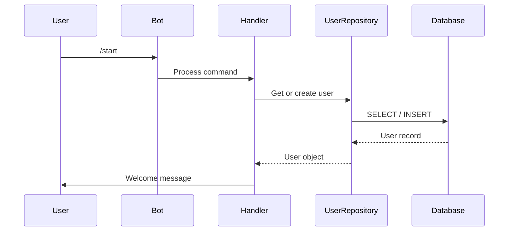

# System Architecture

[← Back to Documentation](../README.md)

## Overview

Telegram Voice2Text Bot is a Python-based asynchronous application for voice message transcription using local Whisper models.

## Technology Stack

### Core Technologies

- **Python 3.11+** - Modern async/await support
- **faster-whisper 1.2.0** - Local transcription (4x faster than openai-whisper)
- **python-telegram-bot 22.5** - Telegram Bot API wrapper
- **SQLAlchemy 2.0** - Async ORM for database operations
- **asyncio** - Asynchronous processing

### Production Configuration

**Recommended setup** (based on production benchmarks):
- **Model**: faster-whisper medium / int8 / beam1
- **Performance**: RTF ~0.3x (3x faster than real-time)
- **Memory**: ~2GB RAM peak (tested in production)
- **Quality**: Excellent for Russian and English

**Processing times:**
- 7 sec audio → ~2 sec processing
- 30 sec audio → ~10 sec processing
- 60 sec audio → ~20 sec processing

## Project Structure

```
telegram-voice2text-bot/
├── src/
│   ├── bot/                 # Telegram bot layer
│   │   ├── handlers.py      # Command and message handlers
│   │   └── __init__.py
│   ├── transcription/       # Whisper integration
│   │   ├── whisper_service.py   # faster-whisper service
│   │   ├── audio_handler.py     # Audio file management
│   │   └── __init__.py
│   ├── storage/             # Database layer
│   │   ├── models.py        # SQLAlchemy models
│   │   ├── database.py      # Database connection
│   │   ├── repositories.py  # Repository pattern
│   │   └── __init__.py
│   ├── config.py            # Configuration (Pydantic Settings)
│   └── main.py              # Application entry point
├── tests/
│   ├── unit/                # Unit tests
│   ├── integration/         # Integration tests
│   └── conftest.py          # Pytest fixtures
├── alembic/                 # Database migrations
├── docs/                    # Documentation
├── memory-bank/             # Claude Code context
└── .github/workflows/       # CI/CD pipelines
```

## System Components

### 1. Bot Layer (`src/bot/`)

**Responsibility**: Telegram interaction

**Components:**
- `handlers.py` - Command and message handlers
  - `/start` - User registration
  - `/help` - Help message
  - `/stats` - User statistics
  - Voice message handler - Transcription flow

**Pattern**: Handler-based architecture using `python-telegram-bot`

**Flow:**
```
User Message → Handler → Service Layer → Database → Response
```

### 2. Transcription Layer (`src/transcription/`)

**Responsibility**: Audio processing and transcription

**Components:**
- `whisper_service.py` - Whisper model management
  - Model loading and caching
  - Transcription execution
  - Resource management
- `audio_handler.py` - Audio file operations
  - Download from Telegram
  - Format conversion (OGG → compatible format)
  - Cleanup

**Pattern**: Service pattern with resource pooling

**Flow:**
```
Voice Message → Download → Convert → Transcribe → Cleanup
```

### 3. Storage Layer (`src/storage/`)

**Responsibility**: Data persistence

**Components:**
- `models.py` - SQLAlchemy ORM models
  - `User` - User information
  - `Usage` - Transcription records
  - `Transaction` - Future billing (planned)
- `database.py` - Database connection and session management
- `repositories.py` - Repository pattern for data access
  - `UserRepository`
  - `UsageRepository`

**Pattern**: Repository pattern with async SQLAlchemy

**Flow:**
```
Service → Repository → SQLAlchemy → Database
```

### 4. Configuration (`src/config.py`)

**Responsibility**: Application configuration

- Pydantic Settings for type-safe configuration
- Environment variable loading
- Validation and defaults

## Data Flow

### Voice Message Transcription



### User Registration



## Database Schema

### User Table

```python
class User(Base):
    id: int                    # Primary key
    telegram_id: int           # Unique Telegram ID
    username: str | None       # Telegram username
    first_name: str | None     # User first name
    last_name: str | None      # User last name
    language_code: str | None  # Preferred language
    created_at: datetime       # Registration time
    updated_at: datetime       # Last update
```

### Usage Table

```python
class Usage(Base):
    id: int                    # Primary key
    user_id: int               # Foreign key to User
    audio_duration: float      # Audio length (seconds)
    transcription_text: str    # Result text
    processing_time: float     # Transcription time
    model_used: str            # Whisper model name
    created_at: datetime       # Timestamp
```

## Design Patterns

### Repository Pattern

**Purpose**: Separate data access logic from business logic

```python
class UserRepository:
    async def get_by_telegram_id(self, telegram_id: int) -> User | None:
        ...

    async def create(self, user_data: dict) -> User:
        ...
```

**Benefits:**
- Testable (can mock repositories)
- Swappable storage backends
- Clean separation of concerns

### Service Pattern

**Purpose**: Encapsulate business logic

```python
class WhisperService:
    def __init__(self, model_size: str, device: str):
        self.model = self._load_model(model_size, device)

    async def transcribe(self, audio_path: str) -> str:
        ...
```

**Benefits:**
- Reusable components
- Clear responsibilities
- Easy to test

### Async/Await Pattern

**Purpose**: Non-blocking I/O operations

```python
async def handle_voice(update: Update, context: ContextTypes.DEFAULT_TYPE):
    # Download audio (I/O bound)
    audio_path = await audio_handler.download(file_id)

    # Transcribe (CPU bound, but async wrapper)
    text = await whisper_service.transcribe(audio_path)

    # Save to DB (I/O bound)
    await usage_repo.create(usage_data)
```

**Benefits:**
- Handles concurrent users efficiently
- Better resource utilization
- Responsive even under load

## Scalability Considerations

### Current Architecture (MVP)

- **Single instance** polling mode
- **SQLite** database
- **Local** Whisper models
- **CPU** processing

**Supports**: ~10-50 concurrent users

### Future Scaling (Phase 4+)

- **Webhook mode** for better performance
- **PostgreSQL** for multi-instance support
- **Redis** for caching and queue
- **Worker pool** for horizontal scaling

**Target**: 100-1000+ concurrent users

## Key Technical Decisions

### Why faster-whisper?

- 4x faster than openai-whisper
- Lower memory usage (int8 quantization)
- Same quality
- Production-proven

### Why SQLite for MVP?

- Zero configuration
- Single-file database
- Sufficient for current scale
- Easy migration to PostgreSQL later

### Why Polling mode?

- Simpler setup (no webhook server)
- Works without domain/SSL
- Perfect for VPS deployment
- Adequate performance for current scale

## Performance Metrics

### Resource Usage (Production)

- **Idle**: ~300-400MB RAM
- **Peak**: ~2GB RAM (during transcription)
- **CPU**: ~100-200% during transcription (2 cores)
- **Disk**: ~2GB (models) + database

### Response Times

- **Command response**: <100ms
- **Voice transcription**: 0.3x real-time (faster-whisper medium)
- **Database queries**: <10ms (SQLite)

## Testing Strategy

### Unit Tests

- Repository CRUD operations
- Service business logic
- Model validation
- Configuration loading

### Integration Tests

- Bot handler flow
- Database migrations
- Whisper service with real audio

### E2E Tests (Planned)

- Full user flow
- Error handling
- Performance under load

## Related Documentation

- [Testing Guide](testing.md) - Development and testing
- [Dependencies](dependencies.md) - Package management
- [Git Workflow](git-workflow.md) - Development workflow
