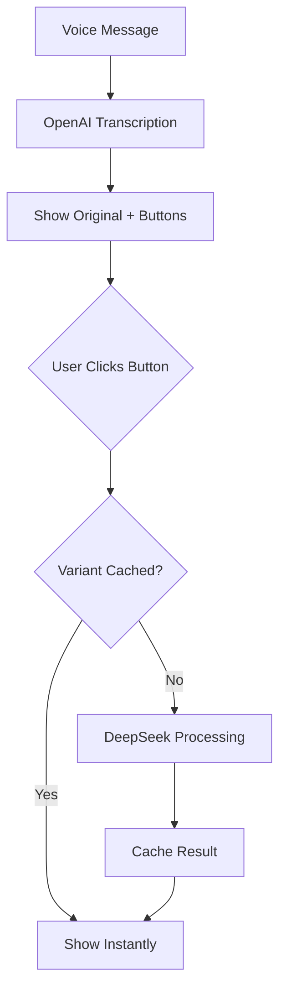

# Interactive Transcription Modes

[← Back to Documentation](../README.md)

## Overview

After transcribing a voice message, the bot shows interactive buttons that let you process the text in different ways. All processed variants are cached - repeated clicks show results instantly!

## The Three Main Buttons

### 📝 Структурировать (Structure)

**What it does:** Automatically structures your transcription with proper formatting

**Perfect for:**
- Meeting notes
- Lectures and talks
- Long voice messages
- Planning and brainstorming

**Example transformation:**
```
Before (raw):
ну слушай вот что я думаю насчет этого проекта во первых нам надо разобраться с бекендом потом подумать про фронтенд а еще есть вопрос с деплоем

After (structured):
# Мысли о проекте

Вот что нужно сделать:

1. **Бекенд**
   - Разобраться с архитектурой

2. **Фронтенд**
   - Продумать интерфейс

3. **Деплой**
   - Решить вопрос с развертыванием
```

**Configuration:**
```env
ENABLE_STRUCTURED_MODE=true
STRUCTURE_EMOJI_LEVEL=1  # 0=no emojis, 1=few, 2=moderate, 3=many
```

---

### 🪄 Сделать красиво (Make it Beautiful)

**What it does:** Transforms transcription into publication-ready text while preserving your unique voice and style

**Perfect for:**
- Telegram channel posts
- Blog articles
- Social media content
- Professional communication

**Key features:**
- Preserves author's personality and tone
- Adds warmth and conversational style
- Makes text engaging and readable
- Keeps your unique expressions

**Example transformation:**
```
Before (raw):
короче я тут подумал знаешь этот подход с микросервисами он типа норм но есть нюансы надо правильно границы выбрать

After (beautiful):
Знаешь, я тут подумал про микросервисы 🤔

Подход хороший, реально работает. Но есть важный момент — нужно правильно выбрать границы между сервисами. Это прям ключевое.

Если промахнешься с границами, потом будешь страдать. Проверено на практике.
```

**Configuration:**
```env
ENABLE_MAGIC_MODE=true
```

**How it works:**
- Powered by DeepSeek V3 LLM
- Uses specialized prompt from `prompts/magic.md`
- Maintains author's vocabulary and style
- Adds structure without changing meaning

---

### 📋 О чем этот текст (What's This About)

**What it does:** Creates a concise summary with key points

**Perfect for:**
- Quick review of long messages
- Sharing highlights with others
- Meeting summaries
- Research notes

**Example transformation:**
```
Before (5 minute voice message about project):
[Long discussion about project architecture, decisions, and next steps...]

After (summary):
## Ключевые моменты

**Архитектурные решения:**
- Переходим на микросервисную архитектуру
- Выбрали PostgreSQL для основной БД
- Используем Redis для кеширования

**Следующие шаги:**
1. Настроить CI/CD pipeline
2. Мигрировать данные пользователей
3. Провести нагрузочное тестирование

**Риски:**
- Deadline через 2 недели (tight!)
- Нужен дополнительный DevOps инженер
```

**Configuration:**
```env
ENABLE_SUMMARY_MODE=true
```

---

## How Interactive Mode Works

### Workflow

1. **Send voice message** → Bot starts transcription
2. **Show progress** → Live updates every 5 seconds
3. **Display original** → Raw transcription with buttons
4. **Click button** → Get processed version
5. **Switch modes** → Click different buttons to try other formats
6. **Instant results** → Cached variants load immediately

### Variant Caching

All processed texts are stored in database:

```python
# Database model
class TranscriptionVariant:
    usage_id: int  # Link to original transcription
    mode: str  # "structured", "magic", "summary"
    text_content: str  # Processed text
    llm_model: str  # "deepseek-chat"
    created_at: datetime
    last_accessed_at: datetime
```

**Benefits:**
- Instant re-display (no LLM call needed)
- Consistent results
- Cost-effective (process once, use many times)
- Up to 10 variants per transcription

**Cache TTL:** 7 days (configurable via `VARIANT_CACHE_TTL_DAYS`)

### Processing Flow



## Optional Features (Disabled by Default)

### Length Variations

Adjust text length with dynamic buttons:

```env
ENABLE_LENGTH_VARIATIONS=true
```

5 levels: shorter → short → default → long → longer

### Emoji Options

Control emoji density:

```env
ENABLE_EMOJI_OPTION=true
```

4 levels: none → few → moderate → many

### Timestamps

For long audio (>5 min), show segment timestamps:

```env
ENABLE_TIMESTAMPS_OPTION=true
TIMESTAMPS_MIN_DURATION=300  # 5 minutes
```

### Retranscribe

Try different transcription models:

```env
ENABLE_RETRANSCRIBE=true
```

Options: Free (better local model) or Paid (OpenAI premium)

## Technical Details

### State Management

Each transcription has associated state:

```python
class TranscriptionState:
    usage_id: int  # Link to transcription
    message_id: int  # Telegram message ID
    chat_id: int
    active_mode: str  # Current mode ("original", "structured", etc.)
    emoji_level: int
    timestamps_enabled: bool
```

### Callback Handlers

Interactive buttons use Telegram callback queries:

```python
# Button callback data format
"mode:125:mode=structured"  # action:usage_id:params
```

### LLM Integration

All modes use DeepSeek V3 via `TextProcessor`:

```python
# Text processing
structured = await text_processor.create_structured(text)
magic = await text_processor.create_magic(text)
summary = await text_processor.create_summary(text)
```

Prompts stored in `prompts/*.md` files for easy customization.

## Performance

**Average processing time:**
- Structured mode: 3-5 seconds
- Magic mode: 3-5 seconds
- Summary mode: 2-4 seconds

**Cost per processing:**
- DeepSeek V3: ~$0.0002 per request
- 30x cheaper than OpenAI GPT-4

## Enabling Interactive Mode

**Minimum required configuration:**

```env
# Enable interactive features
INTERACTIVE_MODE_ENABLED=true

# Enable LLM processing (REQUIRED)
LLM_REFINEMENT_ENABLED=true
LLM_API_KEY=sk-your-deepseek-key

# Enable specific modes
ENABLE_STRUCTURED_MODE=true
ENABLE_MAGIC_MODE=true
ENABLE_SUMMARY_MODE=true
```

## Troubleshooting

### Buttons don't appear
- Check `INTERACTIVE_MODE_ENABLED=true`
- Verify `allowed_updates=Update.ALL_TYPES` in bot initialization

### Buttons show "Loading..." forever
- Check LLM_API_KEY is valid
- Verify LLM_REFINEMENT_ENABLED=true
- Check bot logs for errors

### Variants not caching
- Check database is writable
- Verify MAX_CACHED_VARIANTS_PER_TRANSCRIPTION > 0
- Check composite unique key constraints

## Related Documentation

- [LLM Integration](llm-integration.md) - How DeepSeek processing works
- [Configuration Guide](../getting-started/configuration.md) - Setup instructions
- [Architecture](../development/architecture.md) - Technical implementation details
- [Costs](../deployment/costs.md) - API pricing breakdown
