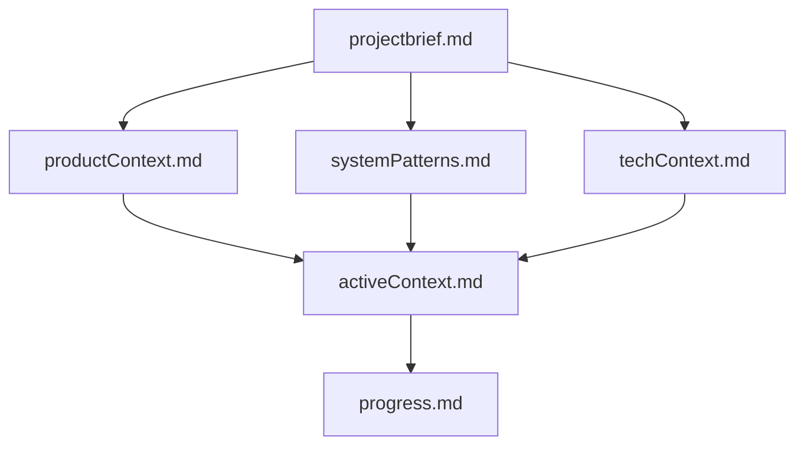
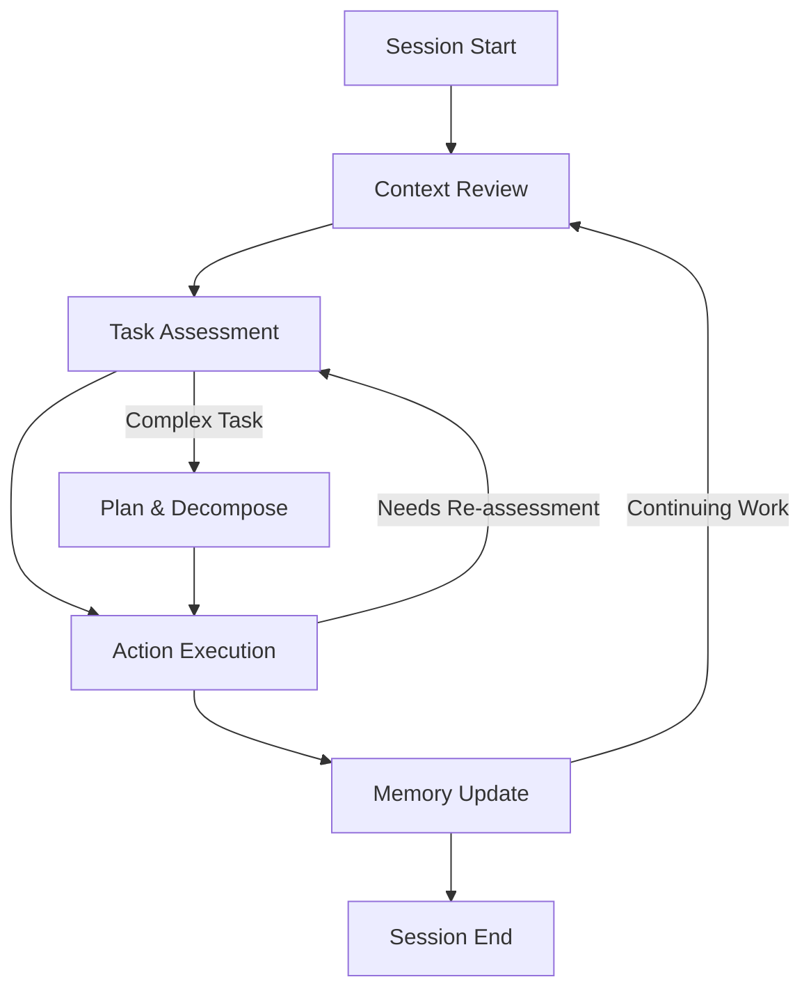
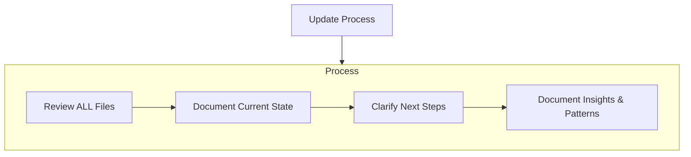

# Claude Code Memory Bank System

A system for maintaining project context across Claude Code sessions. This enables Claude Code to provide consistent development assistance throughout the project lifecycle.

## Memory Bank Structure

The Memory Bank consists of core files and optional context files, all in Markdown format. Files build upon each other in a clear hierarchy:

### Core Files (Required)

1. `projectbrief.md`
   - Foundation document that shapes all other files
   - Created at project start if it doesn't exist
   - Defines core requirements and goals
   - Source of truth for project scope

2. `productContext.md`
   - Why this project exists
   - Problems it solves
   - How it should work
   - User experience goals

3. `activeContext.md`
   - Current work focus
   - Recent changes
   - Next steps
   - Active decisions and considerations
   - Important patterns and preferences
   - Learnings and project insights

4. `systemPatterns.md`
   - System architecture
   - Key technical decisions
   - Design patterns in use
   - Component relationships
   - Critical implementation paths

5. `techContext.md`
   - Technologies used
   - Development setup
   - Technical constraints
   - Dependencies
   - Tool usage patterns

6. `progress.md`
   - What works
   - What's left to build
   - Current status
   - Known issues
   - Evolution of project decisions

### Additional Context

Create additional files/folders within memory-bank/ when they help organize:
- Complex feature documentation
- Integration specifications
- API documentation
- Testing strategies
- Deployment procedures

## Core Workflow

Development sessions benefit from a systematic approach to Memory Bank usage:

### Core Steps Explained

1. **Context Review**: Review loaded Memory Bank context to understand current project state
2. **Task Assessment**: Analyze task complexity, risk, and required approach
3. **Plan & Decompose** (Complex Tasks): Break down complex tasks into manageable subtasks with clear implementation strategy
4. **Action Execution**: Implement solution using appropriate methodology
5. **Memory Update**: Document important changes and learnings for future sessions

## Documentation Updates

Memory Bank updates occur when:
1. Discovering new project patterns or architectural decisions
2. After implementing significant code changes or completing major features
3. When comprehensive review is needed to maintain accuracy
4. When context needs clarification for future sessions
5. At natural project milestones (e.g., completing authentication system, finishing API endpoints)

Note: Comprehensive updates should review all Memory Bank files, even if some don't require changes. Focus particularly on activeContext.md and progress.md as they track current state.

## Operational Principles

- Start each session by understanding Memory Bank context
- Apply documented patterns and decisions consistently
- Document significant changes and decisions promptly
- Maintain Memory Bank accuracy as the foundation for effective assistance

## Remember
Each session starts completely fresh. The Memory Bank is the only persistent link to previous work. It must be maintained with precision and clarity, as effectiveness depends entirely on its accuracy.

--- End of Contents ---